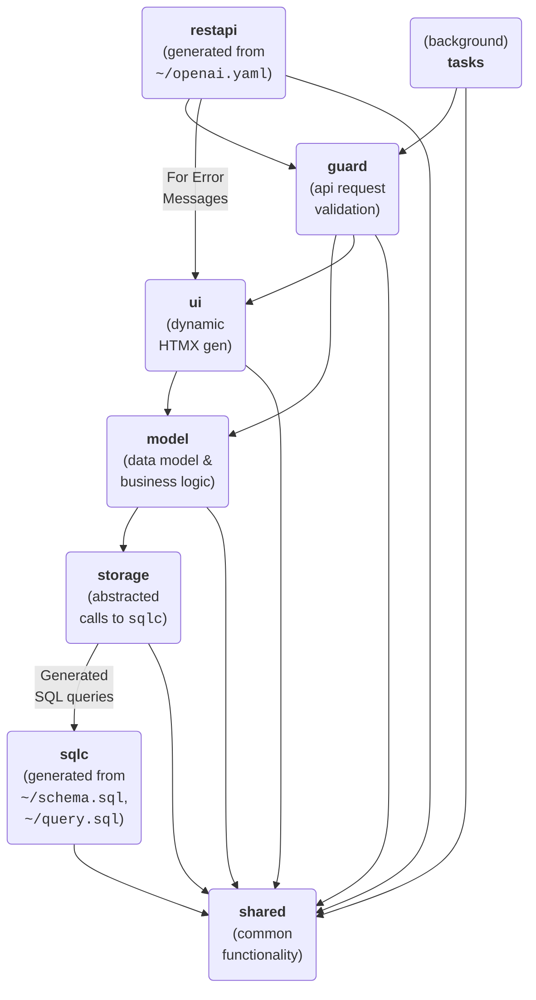

# SaveTabs Daemon Architecture

The lowercase terms in bold are GoLang packages, and the arrows indicate which packages make calls to which other packages.

```mermaid
flowchart TD

%% Nodes
    RA("<strong>restapi</strong><br>(generated from<br><code>~/openai.yaml</code>)")
    GD("<strong>guard</strong><br>(api request<br>validation)")
    ML("<strong>model</strong><br>(data model & <br>business logic)")
    UI("<strong>ui</strong><br>(dynamic<br>HTMX gen)")
    ST("<strong>storage</strong><br>(abstracted<br>calls to <code>sqlc</code>)")
    SC("<strong>sqlc</strong><br>(generated from<br><code>~/schema.sql</code>,<br><code>~/query.sql</code>)")
    SH("<strong>shared</strong><br>(common<br>functionality)")
    TK("(background)<br><strong>tasks</strong>")

%% Edge connections between nodes
    RA --> GD  
    RA -- For Error<br>Messages --> UI  
    GD --> ML 
    GD --> UI 
    UI --> ML 
    ML --> ST 
    ST --  Generated<br>SQL queries --> SC
    RA --> SH 
    UI --> SH 
    ST --> SH 
    GD --> SH 
    ML --> SH 
    SC --> SH
    TK --> GD 
    TK --> SH 

```
