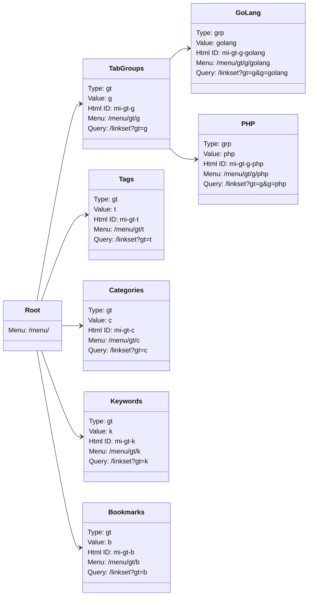

# SaveTabs Menu Structure

```mermaid
classDiagram
direction LR

%% Nodes
class Root {
  Menu: /menu/
}
class TabGroups {
  Type: gt
  Value: g   
  Html ID: mi-gt-g
  Menu: /menu/gt/g
  Query: /linkset?gt=g
}
class GoLang {
  Type: grp
  Value: golang   
  Html ID: mi-gt-g-golang
  Menu: /menu/gt/g/golang
  Query: /linkset?gt=g&g=golang
}
class PHP {
  Type: grp
  Value: php   
  Html ID: mi-gt-g-php
  Menu: /menu/gt/g/php
  Query: /linkset?gt=g&g=php
}
class Tags {
  Type: gt
  Value: t   
  Html ID: mi-gt-t
  Menu: /menu/gt/t
  Query: /linkset?gt=t
}
class Categories {
  Type: gt
  Value: c   
  Html ID: mi-gt-c
  Menu: /menu/gt/c
  Query: /linkset?gt=c
}
class Keywords {
  Type: gt
  Value: k   
  Html ID: mi-gt-k
  Menu: /menu/gt/k
  Query: /linkset?gt=k
}
class Bookmarks {
  Type: gt
  Value: b   
  Html ID: mi-gt-b
  Menu: /menu/gt/b
  Query: /linkset?gt=b                                                                                     
}

%% Edge connections between nodes
Root --> TabGroups
Root --> Tags
Root --> Categories
Root --> Keywords
Root --> Bookmarks
TabGroups --> GoLang
TabGroups --> PHP
```

