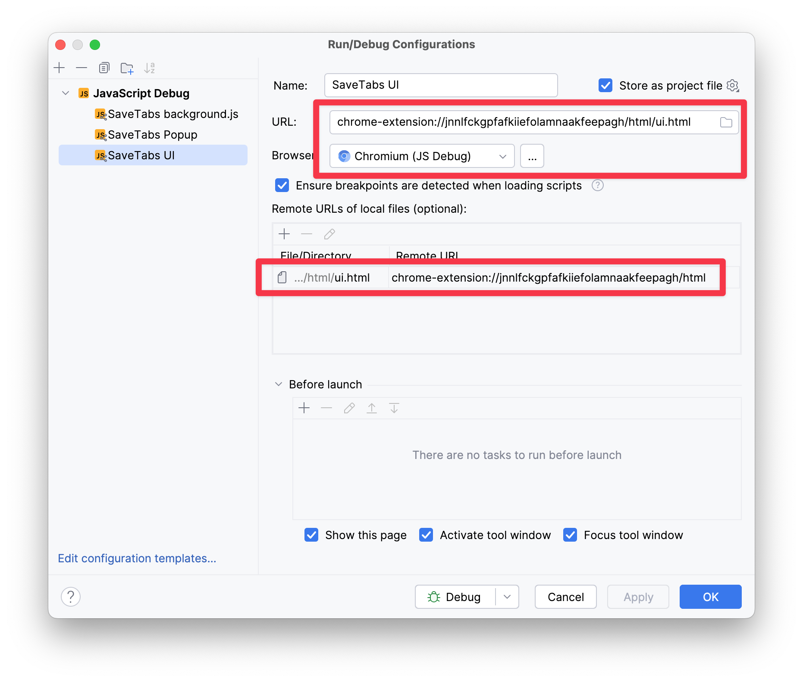
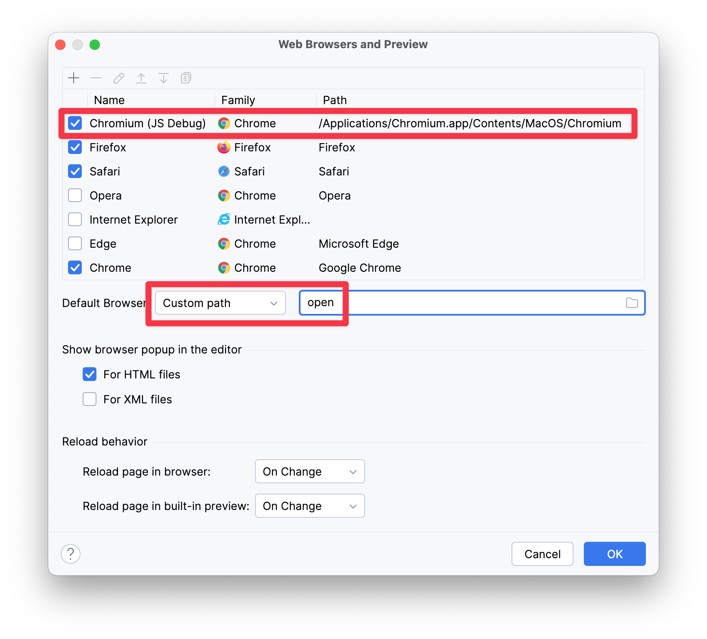
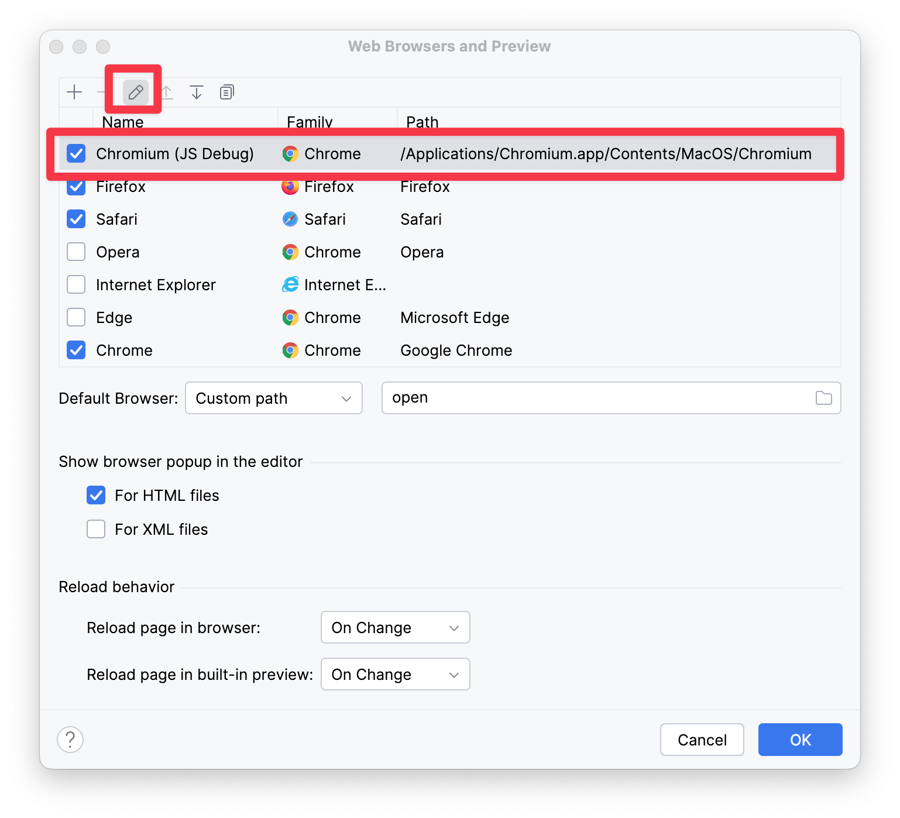
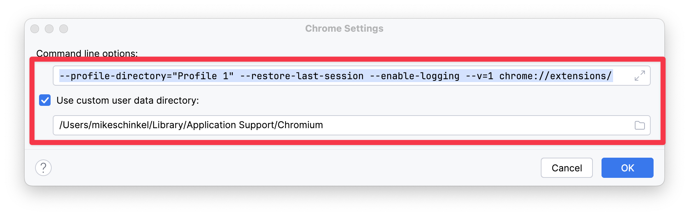

# Setting up Chrome Extension Debugging in WebStorm

## The Run/Debug Configurations Dialog 
The URL uses a `chrome-extension://` and has the browser+installation specific extension ID assigned by the browser as the first URL path segment after which is in the extensions namespace. In my example, I have a directory `/html` where I have stored all my extension's `.html` files.



## The Web Browsers and Preview Dialog
I am using Chromium to allow me to use Chrome as a regular browser w/o having to worry about loosing open tabs while developing the extension.



## Edit Chromium settings in the Web Browsers and Preview Dialog
Highlight _"Chromium (JS Debug)_ and click the pencil.  The _"(JS Debug)"_ is in reference to a Chromium profile although the profile is actually specified elsewhere.



## The Chrome Settings Dialog
Here are the command line switches to use, with one on each line to make easier to read: 
```sh
--profile-directory="Profile 1" 
--restore-last-session 
--enable-logging 
--v=1 
chrome://extensions/
```
Note that you need to specify a profile for smooth operation, otherwise Chromium will not behave. _(TODO: document exactly what it does wrong.)_




## See Also:

- https://youtrack.jetbrains.com/issue/WEB-9708